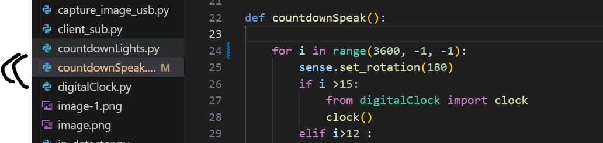
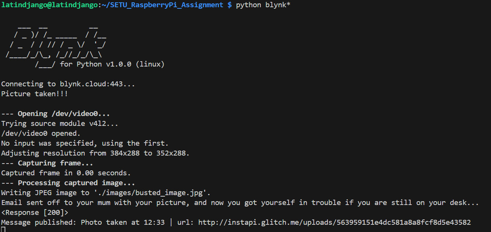
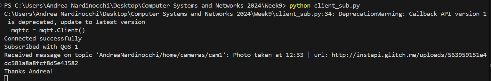
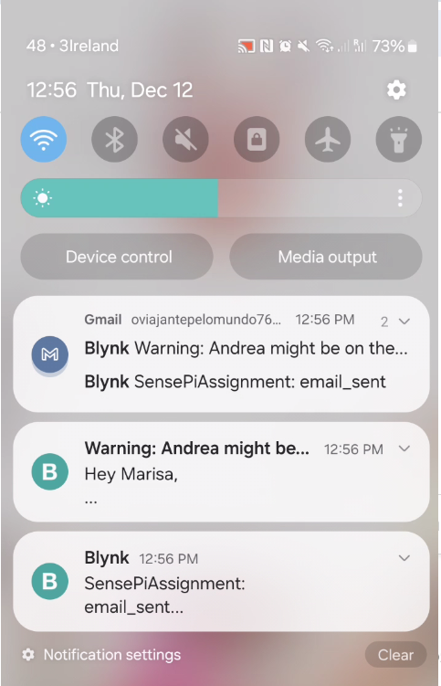
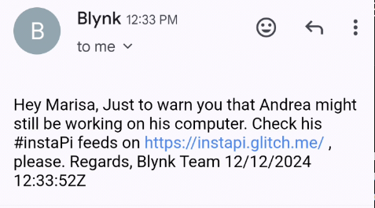
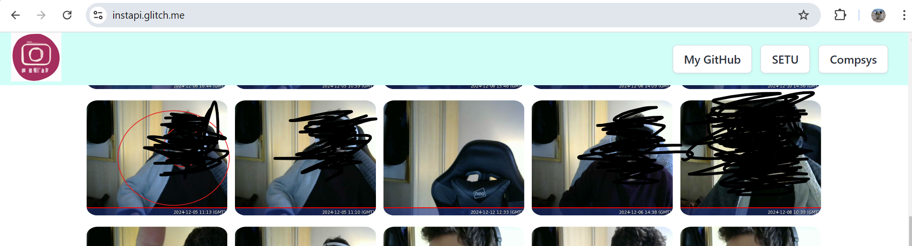
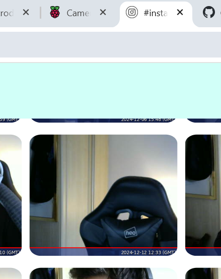
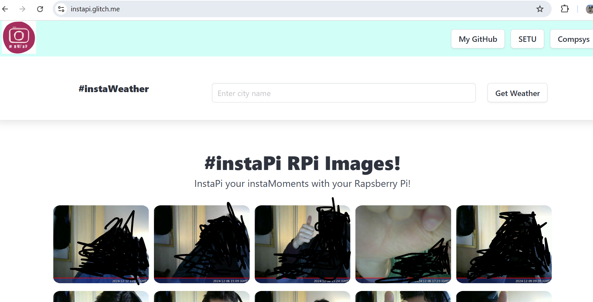
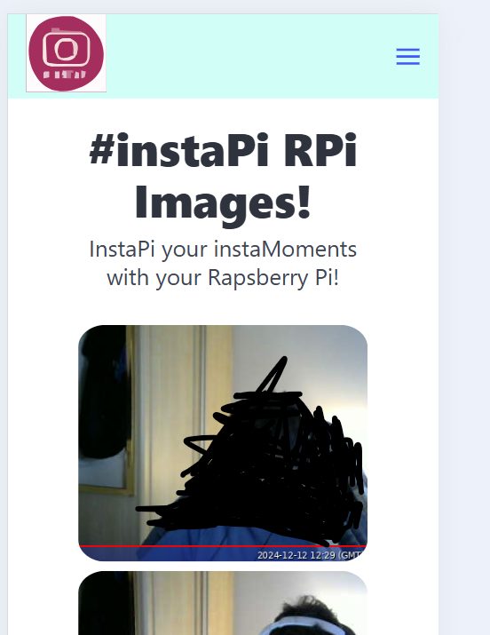
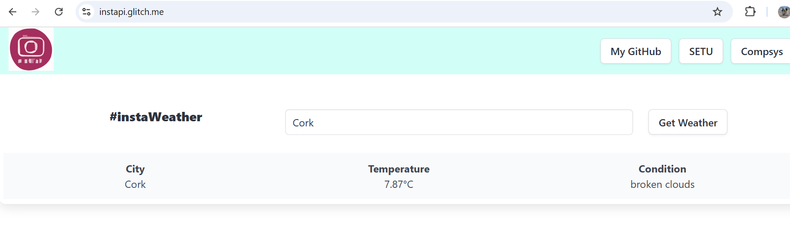

# RaspberryPi project

A starter project for learning how to code with Python interpreting language on a Raspberry Pi integrated with IoT concepts in the framework of the Computer Systems & Network module in the [Higher Diploma in Computer Science 2024](https://tutors.dev/course/setu-hdip-comp-sci-2024-comp-sys) course by [SETU](https://www.setu.ie/) (South East Technological University), Waterford, Ireland.

This is a python.py project with a Raspberry Pi, Sense Hat, camera, and a Glitch landing page. It includes basic HTML, CSS Bulma framework, node.js, javascript and python.


// This file has been created via https://markdownlivepreview.com/ //

# SETU RaspberryPi Assignment
This is a Raspberry Pi/IoT project created to be submitted as a final assignment for [SETU](https://www.setu.ie/), Ireland.

# App
The App utilizes several python.py files, which are linked to each other in order to achieve a seamless flow of intended actions triggered by one python command only on the python file on the 'top of the chain'. However, part of the final outcome will be viewable on a [Glitch](https://glitch.com/) landing page where other progamming languages will kick in to close the circle on the overall project.


# What this project does
This App attempt to provide a solution to an issue that many computer science enthuses and, more in general, people working on spending leisure time on PC are facing off nowadays, which is **addiction/anxiety**.

In a nutshell, to have the Raspberry Pi keep track of the time a user spends on their PC by detecting their PC IP address and triggering a countdown (1 or 2 hours). The Sense Hat will kick off the countdown by showing colored  at some point, which will in turn change to a different color as seconds pass by. At the very last 9 seconds of the 1 or 2 hours countdown above-mentioned, the raspberry pi LEDs will show the countdown in numbers. 

When the countdown is at zero, a warning message will display on the Sense Hat LEDs as well as an audio message will be triggered demanding that the user step away from the desk.
After a few seconds a Pat Metheny Group mp3 song will start playing in the background, which, basically, give another 5/6 minutes of _grace period_ to the user (sort of 'sweet final warning').

Once the song is over, the camera will take a photo of the user on the desk, and a notification will be sent to the user's phone as well as an email informing about the event (picture taken) with a link of the Glitch landing page, which will show a sort of picture feeds of the user itself. The goal would be to send off a notification and email to a third party, who can, then, monitor the user's activity on the Glitch landing page, and verify whether the user is still on their desk working away or whether they have finally left, as expected.


# Why the project is useful
The project is useful for those users that struggle with anxiety and electronic deveices addiction, as it attempts to offer some sort of help, which will need, of course, the full support of a friend or family member who will take on the burden of checking the Glitch landing page upon receving a notification/email and , maybe, ring the user to check in on them. 

However, the main purpose of the project was for the writer to be exposed to the use of pyhton, Raspberry Pi, Sense Hat, pythonand Glitch, Bulma components, HTML, JavaScript, and node.js.

# How users can get started with the project

## ip_detector.py

In order for a user to be able to reproduce the expected outcome of this project **nmpa** should be installed:

```
sudo apt-get install nmap
```
Then, the Network IP Address and subnet mask of the user RPi should be found by entering **ip a** at the command line:


Using the IP address/subnet, the user should scan for the presence of a device on the subnet of their RPi by doing a ‘grep’ using Nmap (replacing the ‘999.999.999.999/24’ with the user IP Network address/):

```
sudo nmap -sn 999.999.999.999/99 | grep Nmap
```
Tha above command is called from the **ip_detector.py** program using the subprocess library (the user wiill need to change the network address,

```
import subprocess
from countdownSpeak import countdownSpeak


# Find IP address Function
def find_myLaptopIP_Address(target_IPs, ip_range="192.168.0.1/24"):
    result = subprocess.check_output(f"sudo nmap -sn {ip_range} | grep Nmap", shell=True)
    found_IPs=[]
    for IP in target_IPs: 
         if IP.lower() in str(result).lower():
             found_IPs.append(IP)         

    return found_IPs
```

 and ip address to detect to match theirs):

 ```
 # Test code
if __name__ == "__main__":
    # Example list of target IP addresses to search for on the network
    target_IPs = [
        "192.168.0.56",  # Replace with actual IP addresses you expect to find
        "11:22:33:44:55:66"
    ]
```

To get the program up and running the user only need to input the below command:

```
pythong ip_detector.py
```
At that point the scanning operations will kick off, and the terminal will return the following message once the expected ip address has been detected:


This means that the user is on, and the countdown has just begun (countdownSpeak.py).

```
# Display the result
    if found_devices:
        print(f"Found devices:{found_devices}...There you go, he is on!\nBeware Andrea, the countdown has just started...")
        countdownSpeak()
    else:
        print("No target IP addresses found on the network.")
```

### Sources:
https://tutors.dev/course/setu-hdip-comp-sci-2024-comp-sys

## countdownSpeak.py

As the **countdownSpeak.py** program has been called in into the ip_detector.py file by using the function _countdownSpeak()_ , let's take a close look at this file.

In here, **Sense Hat** is called into action for the very first time.

As the countdown kicks off into the _countdownSpeak()_ function, Sense Hat display a clock on its LEDs whose program can be checked in the **digitalClock.py** called in via the _clock()_ function:



 Additionally, **pyttsx3** is imported too (It is a text-to-speech conversion library in Python, which needs to be install into the raspberry pi:

```
# Linux installation requirements
sudo apt update && sudo apt install espeak ffmpeg libespeak1

```
)

As the countdown hits the 15 seconds the Sense Hat LEDs will replace the clock with a full-blown 'bright blue' background, which will, then, turn into red when hitting the 12 seconds threshold. This is just a prelude of the countdown finally showing numbers when the 9 seconds threshold gets hit. 

This effect has been achieved by utilizing a _for_ _loop_ with _if_ statements:

```
def countdownSpeak():

    for i in range(3600, -1, -1):
        sense.set_rotation(180) 
        if i >15:
            from digitalClock import clock
            clock()        
        elif i>12 :
           sense.clear(B)
        elif i > 9 :
           sense.clear(R)
        elif i >= 4 :
            text = R
            bg = W
            sense.show_letter(str(i), text, bg)
        else:
            text = G
            bg = X
            sense.show_letter(str(i), text, bg)
        time.sleep(1)
```

When the countdown hits '0', a new _for_ _loop_ countdown with _if_ statements will kick in with the Sense Hat LEDs showing a message, and a voice will demand that the user step away from the desk and leave the room.

Once the new countdown hits the '0' threshold, the **music.py** program will be triggered and an mp3 will play in the background.

```
for i in range(10, -1, -1):
        if i>0:
            sense.show_message("BOOM!!!!", scroll_speed=0.03, text_colour=[255, 255, 255])
            bg = X 
            # Speaking
            engine.say("Andrea shut that freaking laptop, and get the hell out of here now")
            # Flush the say() queue and play the audio
            engine.runAndWait()
            # Program will not continue execution until
            # all speech is done talking
            time.sleep(0.1) 
        elif i<=0:
            sense.clear(255,255,255)
            from music import patMusicOn
            patMusicOn()
            time.sleep(0.1) 
        else:
            sense.clear(255,255,255)
```

### Sources:
https://projects.raspberrypi.org/en/projects/countdown-timer/2

https://codefather.tech/blog/text-to-speech-in-python/

https://pimylifeup.comraspberry-pi-sense-hat-digital-clock/ 

https://tutors.dev/course/setu-hdip-comp-sci-2024-comp-sys

## music.py

This is an interesting program, which presents some interesting commands and features such as _mpg_ _321_ to have the raspberry pi play an mp3.

First of all, though, _os_ is imported, which is a _module that provides a portable way of using operating system dependent functionality_ as per https://docs.python.org/3/library/os.html , which essentially enables a user to use terminal commands into a program.

This is pivotal for the music.py program to work as intended, since _mpg 321_ only works by using the command in the terminal, as shown below:

```
mpg 321 music.mp3
```

In order to use it, _mpg 321_ needs to get installed first:

```
sudo apt-get update

sudo apt-get -y install mpg321
```

However, the goal was not to use one song only, but to avail of a mini-list of 3 songs to be randomly picked out every time the program is run.
Therefore, I resorted to using a Python’s built-in module in called _random_ to work with random data, and outlined below are the steps followed to get the program to randomly pick out a song:

```
# creating variables
pat1 = 'PatMethenyGroup_FollowMe_live.mp3'
pat2 = 'PatMethenyGroup_IntoTheDream.mp3'
pat3 = 'Pat_Metheny_Group_-_Last_Train_Home.mp3'

# list of items
List = [pat1, pat2, pat3]

# mpg 321 installation https://installati.one/install-mpg321-debian-11/
try: 
    def patMusic():
        print("Pat is on!!!\n")
        os.system(f"mpg321 {random.choice(List)}") 
        os.system("python blynkingMail.py")
    
except KeyboardInterrupt:
    os.clear()
```

Nevertheless, the idea here was also to combine the music in the background with some light effects (basically, running **animationColors.py** at the same time as _mpg 321_ is run) to create a 'disco effect' like.

After some research, I discovered that the _threading_ module had a very interesting solution, which I applied as follow:

```
from threading import Thread

t1 = Thread(target=animatedLights)
threads = [t1]
t2 = Thread(target=patMusic)
threads += [t2]

t1.start()
t2.start()

try: 
    def patMusicOn():
        
        for tloop in threads:
            tloop.join()

except KeyboardInterrupt:
    os.clear()

```
_t1_ and _t2_ are variables calling the functions _animatedLights_ and _patMusic_ by using the callable object _target_, which will, in turn, be evoked by the _start()_ function.

The _for loop_, then, and the join() function joins them together, and enables them to run simultaneously.

Once the mp3 song has come to an end, the following command will get triggered:

```
python blynkingMail.py
```

in
```
def patMusic():
        print("Pat is on!!!\n")
        os.system(f"mpg321 {random.choice(List)}") 
        os.system("python blynkingMail.py")
```

### Sources:

https://docs.python.org/3/library/os.html

https://installati.one/install-mpg321-debian-11/ 

https://www.geeksforgeeks.org/randomly-select-elements-from-list-without-repetition-in-python/

https://forums.raspberrypi.com/viewtopic.php?t=235173

https://docs.python.org/3/library/threading.html

https://tutors.dev/course/setu-hdip-comp-sci-2024-comp-sys


## blynkingMail.py

This program will seamlessly connect the raspberry pi with the Blynk App to really create a IoT environment experience for the user. The main aim in here is to have a camera take a a picture of the user on the desk, upload it to a webiste (sort of an instagram feed landing page), and trigger an automation feature in Blynk which will see the user get sent an email, and a Blynk app notification on their mobile.

In order to achieve this, the user, of course, needs to open an account in https://blynk.io/ , and read the documentation to set up a template, and automations in https://blynk.cloud/dashboard/129389/automations (this link is for my account automation).

Then, the _BlynkLib_ library needs to be imported into the program to create the connection. However, it is also worth noticing that 2 internal modules need to be imported in order for the camera to be able to take a photo and upload it to a URL/landing page:

```
import BlynkLib
from time import sleep
from sense_hat import SenseHat
import paho.mqtt.client as mqtt
from urllib.parse import urlparse
from datetime import datetime
from capture_image_usb import captureImagePath
from upload_image import upload_image
```
By doing it, we are essentially nesting 2 programs into the blynkingMail.py, which are **capture_image_usb.py**, and **upload_image.py**.
The reason why the first of the above-mentioned program has a __usb.py_ suffix sort of is because I resolved to use a 'logi' webcamera placed on top of my screen and plugeed into the raspberry pi via USB instead of using a raspberry pi camera. The reason for that comes down to ensuring that a clear picture of the user on the desk gets taken since it also needs to be uploaded online, hence, some high level of visibility plays in.

To be able to use the USB webcome, the following packages were installed:

```
sudo apt install fswebcam

sudo usermod -a -G video <username>
```

At the end of the randome song played out, the program will take a picture of the user, send an email, notify the user on their mobile via the Blynk app, and upload the photon on https://instapi.glitch.me/ (A sort of insta photo feed landing page craeted _ad hoc_ for this project https://github.com/AndreaNardinocchi/instaPi).

Additionally, the transport layer protocol **MQTT** was utilized as a broker to send out the image publication topic to subscribers (ex.**client_sub.py** wich should be run from a different machine or from the same one, but outside the remote raspberry pi environment for testing purposes):



blynkingEmail.py



client_sub.py

The notification and email were received:





The photo uploaded to https://instapi.glitch.me/ can be observed below (lucky for the user, they had already stepped away from the desk!!!):






More info about the #instaPi landing page can be found in https://github.com/AndreaNardinocchi/instaPi .

### Sources:

https://www.raspberrypi.com/documentation/computers/camera_software.html#use-a-usb-webcam

https://github.com/AndreaNardinocchi/instaPi

https://tutors.dev/course/setu-hdip-comp-sci-2024-comp-sys


## #instaPi
The https://instapi.glitch.me/ landing page shows a clean and neat layout, which is also adptive/responsive to any screen size. 



If we take a quick look under the hood, we will see that the Bulma CSS framework was used, as the below code line was added inside the '< head >' tag:
```
 <link rel="stylesheet" href="https://cdn.jsdelivr.net/npm/bulma@1.0.0/css/bulma.min.css" />
```
The only issued encountered was practically how to make the grid/images responsive. However, luckily enough, I was able to sort it out by sing a function on The below function myFunctionx) will enable the image feed section to become responsive and adapt
                        to different screens
                        https://www.w3schools.com/howto/tryit.asp?filename=tryhow_js_matchmedia that I re-adapted to serve this project's purposes:
```
  let x = window.matchMedia("(max-width: 700px)");
  img.src = `/uploads/${image}`;
                     
  // Call listener function at run time
  myFunction(x);
  // Attach listener function on state changes
  x.addEventListener("change", function () {
                                 myFunction(x);
                             });
                     
                             function myFunction(x) {
                                 if (x.matches) {
                                     // If media query matches
                                     img.style.width = "100%";
                                 } else {
                                     img.style.width = "20%";
                                 }
                             }
                             img.style.padding = "0.5%";
                             img.style.borderRadius = "10%";

```




The #instaWeather widget instead is just an 'accessorial' feature added to the landing page, as we wanted to give the user the chance to check the weather after they have been stuck on their PC for long, and may have lost the sense of place and time.


The weather data logic is retrieved via a JavaScript Fetch API as in this example in https://medium.com/@ravipatel.it/a-comprehensive-guide-to-fetching-weather-data-using-javascript-fetch-api-13133d0bc2e6 , whose example has been re-adapted to serve the scope of the #instaPi landing page:

```
         // https://medium.com/@ravipatel.it/a-comprehensive-guide-to-fetching-weather-data-using-javascript-fetch-api-13133d0bc2e6
         
         const API_KEY = 'c3e26a0b5387b001f6f548f5710c0baf';
         const BASE_URL = 'https://api.openweathermap.org/data/2.5/';
         
         
         async function getWeather() {
           const city = document.getElementById('cityInput').value;
           if (!city) {
             alert('Please enter a city name.');
             return;
           }
           
           try {
             // Fetch current weather
             const weatherResponse = await fetch(`${BASE_URL}weather?q=${city}&appid=${API_KEY}&units=metric&units`);
             const weatherData = await weatherResponse.json();
             displayCurrentWeather(weatherData);
           } catch (error) {
             console.error('Error fetching data:', error);
             alert('Failed to fetch weather data.');
           }
         }
           function displayCurrentWeather(data) {
             const weatherBody = document.getElementById('weatherBody');
             weatherBody.innerHTML = `
             
                <div class="column has-text-centered is-4">
                  <p class="has-text-weight-bold"> City </p>
                  <p>${data.name}</p>
                </div>
                <div class="column has-text-centered is-4">
                  <p class="has-text-weight-bold"> Temperature </p>
                  <p>${data.main.temp}°C</p>
                </div>
                <div class="column has-text-centered is-4">
                  <p class="has-text-weight-bold"> Condition </p>
                  <p>${data.weather[0].description}</p>
                </div>
             `;
           }
           
           function displayForecast(data) {
             const forecastBody = document.getElementById('forecastBody');
             forecastBody.innerHTML = '';
         
             // Forecast data comes in 3-hour intervals, so we'll filter to get daily forecasts
             const dailyForecasts = data.list.filter(item => item.dt_txt.includes('12:00:00'));
             dailyForecasts.forEach(forecast => {
               const date = new Date(forecast.dt_txt).toLocaleDateString();
             });
           }
```

The really interesting factor here is the function _function displayCurrentWeather(data)_ which enables to show the weather data on a section on the landing page that will only display once the user has entered their query:




### Sources

https://medium.com/@ravipatel.it/a-comprehensive-guide-to-fetching-weather-data-using-javascript-fetch-api-13133d0bc2e6

https://www.w3schools.com/howto/tryit.asp?filename=tryhow_js_matchmedia

https://tutors.dev/course/setu-hdip-comp-sci-2024-comp-sys


## Bugs/Defects

The audio was meant to go out on a te laptop speakers via bluetooth, but, alas, after numerous attempts I failed. Therefore, a tester/user will have the plug in wired headset into the raspberry pi to be able to listen to the audio.


## Contact info
Users can contact me at andrea.nardinocchi76@gmail.com or by clicking on the website underfoot in https://instapi.glitch.me/ where they can find my name linking to my Linkedin profile.

## Who maintains and contributes to the project
This project will be maintained by myself only.

## Acknowledgements
My lecture at SETU Frank Walsh provided all info I needed to build and set up the programs by transferring knowledge of Computer Networks and Systems, IoT apps, python and son on.

Special thanks to Wolfgang Helnvein who came to my rescue when I could not get my projects uploaded to gitHub. He masterfully walked me through all the required steps, and has been ready to jump in, provide knowledge, recommendations and encouragement. I will never find words that can describe how much I appreciate Wolfgang as a co-student, and as a human being first and foremost.
Also, a big thank you to Pedro Royo who shared some useful resources on Slack, whic I availed of.

Thank you all again!!!