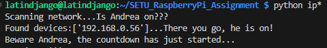

# RaspberryPi project

A starter project for learning how to code with Python interpreting language on a Raspberry Pi integrated with IoT concepts in the framework of the Computer Systems & Network module in the [Higher Diploma in Computer Science 2024](https://tutors.dev/course/setu-hdip-comp-sci-2024-comp-sys) course by [SETU](https://www.setu.ie/) (South East Technological University), Waterford, Ireland.

This is a python.py project with a Raspberry Pi, Sense Hat, camera, and a Glitch landing page. It includes basic HTML, CSS Bulma framework, node.js, javascript and python.


// This file has been created via https://markdownlivepreview.com/ //

# SETU RaspberryPi Assignment
This is a Raspberry Pi/IoT project created to be submitted as a final assignment for [SETU](https://www.setu.ie/), Ireland.

# App
The App utilizes several python.py files, which are linked to each other in order to achieve a seamless flow of intended actions triggered by one python command only on the python file on the 'top of the chain'. However, part of the final outcome will be viewable on a [Glitch](https://glitch.com/) landing page where other progamming languages will kick in to close the circle on the overall project.


# What this project does
This App attempt to provide a solution to an issue that many computer science enthuses and, more in general, people working on spending leisure time on PC are facing off nowadays, which is **addiction/anxiety**.

In a nutshell, to have the Raspberry Pi keep track of the time a user spends on their PC by detecting their PC IP address and triggering a countdown (1 or 2 hours). The Sense Hat will kick off the countdown by showing colored  at some point, which will in turn change to a different color as seconds pass by. At the very last 9 seconds of the 1 or 2 hours countdown above-mentioned, the raspberry pi LEDs will show the countdown in numbers. 

When the countdown is at zero, a warning message will display on the Sense Hat LEDs as well as an audio message will be triggered demanding that the user step away from the desk.
After a few seconds a Pat Metheny Group mp3 song will start playing in the background, which, basically, give another 5/6 minutes of _grace period_ to the user (sort of 'sweet final warning').

Once the song is over, the camera will take a photo of the user on the desk, and a notification will be sent to the user's phone as well as an email informing about the event (picture taken) with a link of the Glitch landing page, which will show a sort of picture feeds of the user itself. The goal would be to send off a notification and email to a third party, who can, then, monitor the user's activity on the Glitch landing page, and verify whether the user is still on their desk working away or whether they have finally left, as expected.


# Why the project is useful
The project is useful for those users that struggle with anxiety and electronic deveices addiction, as it attempts to offer some sort of help, which will need, of course, the full support of a friend or family member who will take on the burden of checking the Glitch landing page upon receving a notification/email and , maybe, ring the user to check in on them. 

However, the main purpose of the project was for the writer to be exposed to the use of pyhton, Raspberry Pi, Sense Hat, pythonand Glitch, Bulma components, HTML, JavaScript, and node.js.

# How users can get started with the project

## ip_detector.py

In order for a user to be able to reproduce the expected outcome of this project **nmpa** should be installed:

```
sudo apt-get install nmap
```
Then, the Network IP Address and subnet mask of the user RPi should be found by entering **ip a** at the command line:


Using the IP address/subnet, the user should scan for the presence of a device on the subnet of their RPi by doing a ‘grep’ using Nmap (replacing the ‘999.999.999.999/24’ with the user IP Network address/):

```
sudo nmap -sn 999.999.999.999/99 | grep Nmap
```
Tha above command is called from the **ip_detector.py** program using the subprocess library (the user wiill need to change the network address,

```
import subprocess
from countdownSpeak import countdownSpeak


# Find IP address Function
def find_myLaptopIP_Address(target_IPs, ip_range="192.168.0.1/24"):
    result = subprocess.check_output(f"sudo nmap -sn {ip_range} | grep Nmap", shell=True)
    found_IPs=[]
    for IP in target_IPs: 
         if IP.lower() in str(result).lower():
             found_IPs.append(IP)         

    return found_IPs
```

 and ip address to detect to match theirs):

 ```
 # Test code
if __name__ == "__main__":
    # Example list of target IP addresses to search for on the network
    target_IPs = [
        "192.168.0.56",  # Replace with actual IP addresses you expect to find
        "11:22:33:44:55:66"
    ]
```

To get the program up and running the user only need to input the below command:

```
pythong ip_detector.py
```
At that point the scanning operations will kick off, and the terminal will return the following message once the expected ip address has been detected:



This means that the user is on, and the countdown has just begun (countdownSpeak.py).

```
# Display the result
    if found_devices:
        print(f"Found devices:{found_devices}...There you go, he is on!\nBeware Andrea, the countdown has just started...")
        countdownSpeak()
    else:
        print("No target IP addresses found on the network.")
```